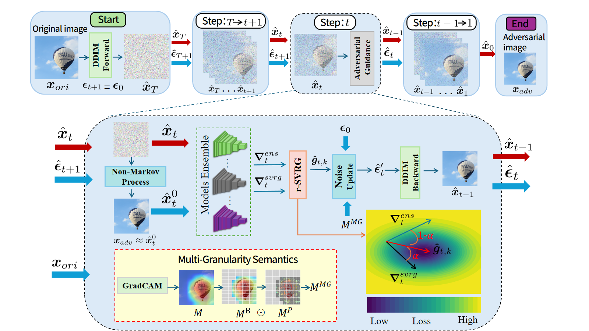

# TRIAD-Attack
Official Repository for Paper: **TRIAD-Attack: A Rescaled Variance-Reduced Diffusion for Transferable and Imperceptible Adversarial Attacks**

## Overview




## Dataset
ImageNet-compatible Dataset from https://github.com/cleverhans-lab/cleverhans/tree/master/cleverhans_v3.1.0/examples/nips17_adversarial_competition/dataset. We have downloaded and stored the images in *./dataset*. 

## Enviroment
Important packages: 
```bash
torch==1.12.1
torchvision==0.13.1
scikit-image==0.16.2
numpy==1.22.4
opencv_python==4.5.4.58
pillow==9.2.0
torchcam==0.3.2
```
## Craft Adversarial Examples
For TRIAD, please run:
```bash
CUDA_VISIBLE_DEVICES=0 python main_TRIAD.py
```
## Test Adversarial Examples
```bash
CUDA_VISIBLE_DEVICES=0 python eval_all.py
```
The configurations are set in function *create_attack_argparser()* at the end of the corresponding python file.

## Contact
```bash
Thanks for your attention! If you have any suggestion or question, you can leave a message here or contact us directly:
x786416205@163.com
```